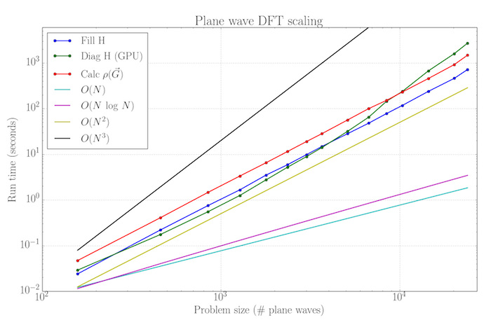

Plane Wave Density Functional Theory on the GPU
=============================

This code solves the Kohn-Sham equations through the plane wave pseudopotential approach. It uses (in part) NVIDIA GPUs to accelerate the calculation. In particular, this code places some of the more computationally taxing parts on the GPU. For now, this includes using CULA Tools (CUDA Lapack) for diagonalization, as well as cuFFT for the Fourier Transform.

The directory structure is set up as follows:

	cula/                  : Contains all files that use CUDA Lapack and/or cuFFT
	cula/generic/          : A starter code that does only diagonalization on the GPU
	cula/silicon/nofft/    : Computes the Charge density in reciprocal space (i.e. no FFT's, and therefore slow)
	cula/silicon/siwfft/   : Computes charge density in real space and uses cuFFT (GPU does the computation)
	cula/silicon/siWfft_w  : Computes charge density in real space and uses FFTW (CPU does the computation)
	mkl/                   : Computes everything on the CPU using MKL instead of CUDA Lapack

The diagonalization on the GPU runs about 10x faster than on a single CPU. A minor scaling study is shown below.

